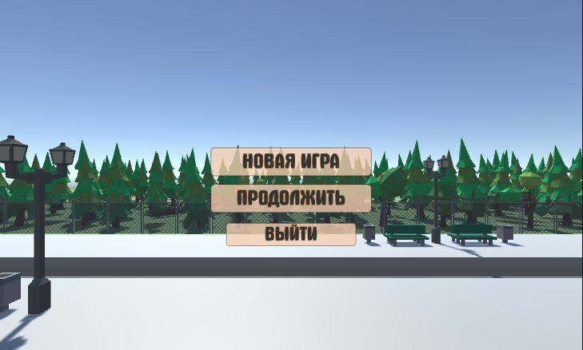
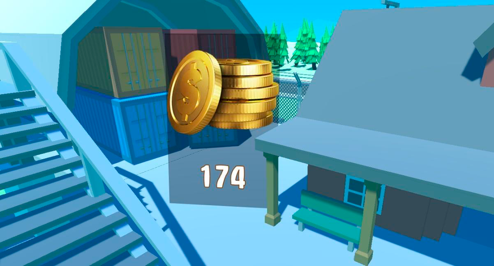
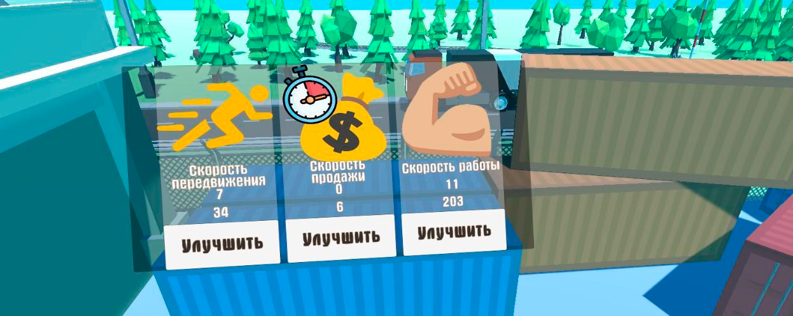
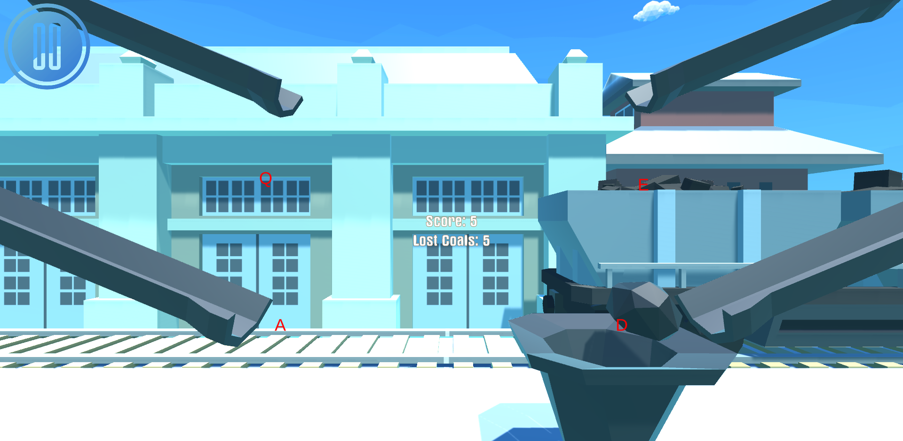
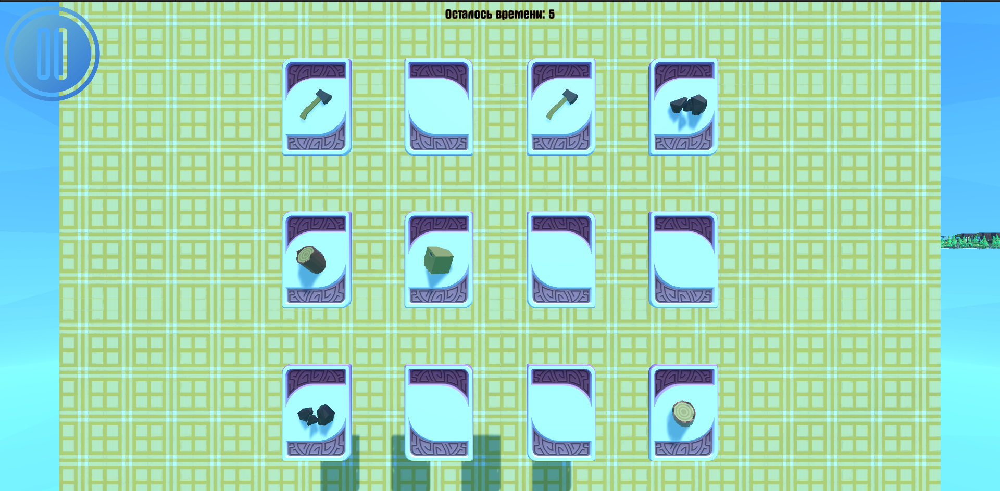
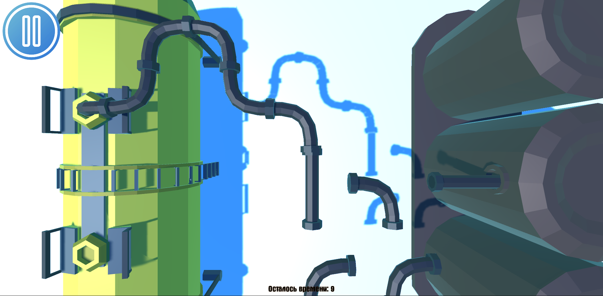
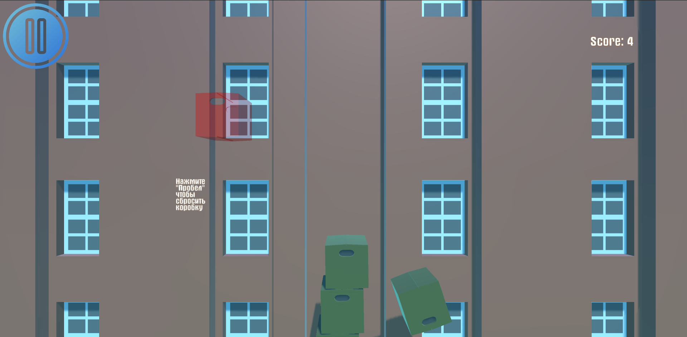

Rus | [Eng](Localization%20Readme/README_eng.md)

# Unity project - Railway empire

Этот проект игры был создан в рамках двухдневного хакатона и позднее доработан.

## Технологии

* **Движок:** Unity
* **Язык программирования:** C#
* **Система контроля версий:** Git
* **Управление пользовательским вводом:** Input System и Input Manager
* **Сохранение игровых данных и настроек:** PlayerPrefs
* **Управление настройками игровых сцен:** ScriptableObject
* **Искусственный интеллект персонажей:** Конечные автоматы (FSM)
* **Визуальный опыт и анимации:** DOTween
* **Дизайн пользовательского интерфейса и локации:** Photoshop, Blender, Mixamo

## Платформа

* Windows

## Описание игры

Игра представляет собой симулятор управления железнодорожной станцией, где игрок берет на себя роль управляющего. Задачи
игрока включают управление станцией, улучшение ее инфраструктуры, контроль за работниками и разгрузка прибывших поездов
с целью перепродажи грузов.

Игра рассматривает "The Battle of Polytopia" как референс и позаимствовала от нее визуальный стиль "Low Poly",
расположение камеры и простоту геймплея в угоду удобства пользователя.

Цель игрока - сделать станцию успешной и процветающей, основное внимание уделяется разгрузке поездов. Для этого был
создан геймплей, который включает в себя мини-игры, соответствующие различным типам вагонов.

**Примечание:** Для полной документации и кода игры, пожалуйста, посетите репозиторий на GitHub.

* [Ссылка на GitHub](https://github.com/ShutovKS/RailwayEmpire)

## Скриншоты игры

### Мини игры:

